# EverBloom — Screenshots

Captured from the running application (`mvn clean javafx:run`) against the seeded
`data/everbloom.db`. They follow the same order as the demonstration in
[`VIVA-CHECKLIST.md`](VIVA-CHECKLIST.md).

---

## 1. Dashboard

Summary figures, recent orders with status badges, and the notification feed.

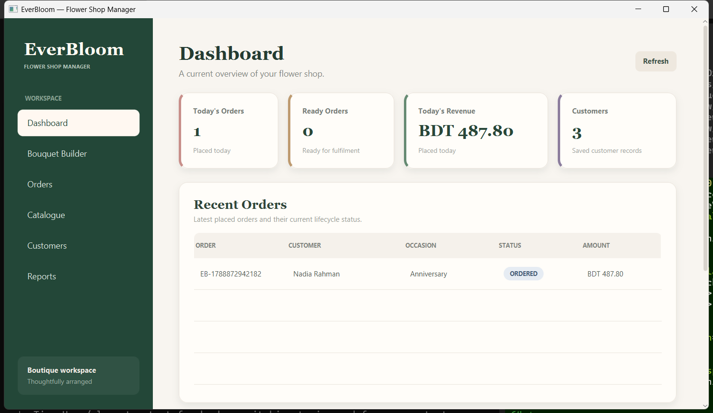

---

## 2. Bouquet Builder — Builder and Command

A bouquet assembled step by step: customer, occasion, wrapping, card message, and
flower lines. The live summary on the right is rebuilt after every edit, and
**Undo** is enabled because the editor has reversible actions on its history.

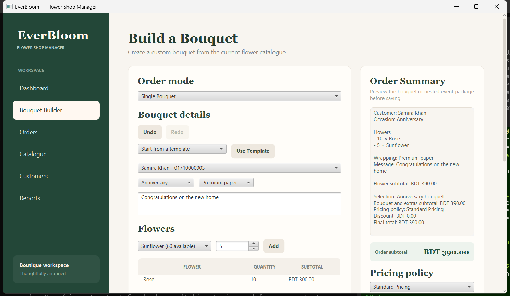

---

## 3. Extras and pricing — Decorator and Strategy

Two extras are layered onto the bouquet (Decorator), and the Loyalty policy is
selected (Strategy): subtotal BDT 257.00 → discount BDT 25.70 → total BDT 231.30.

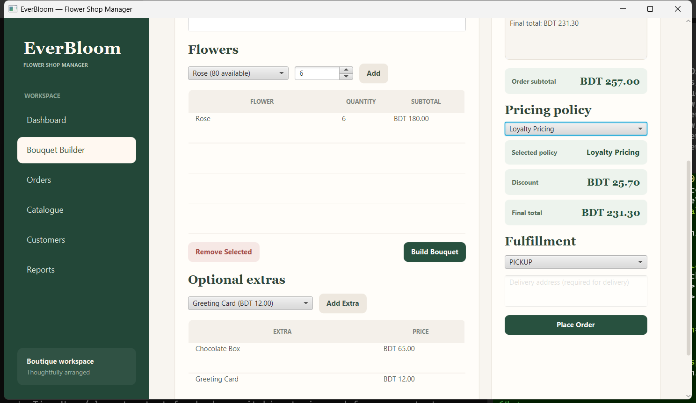

---

## 4. Event package — Composite

A three-level package: *Rahman Wedding Package → Ceremony → Altar Table → Bridal
Bouquet*, with *Aisle Flowers* directly under *Ceremony*. Every group total is a
recursive sum of its children (Ceremony 480.00 = 390.00 + 90.00).

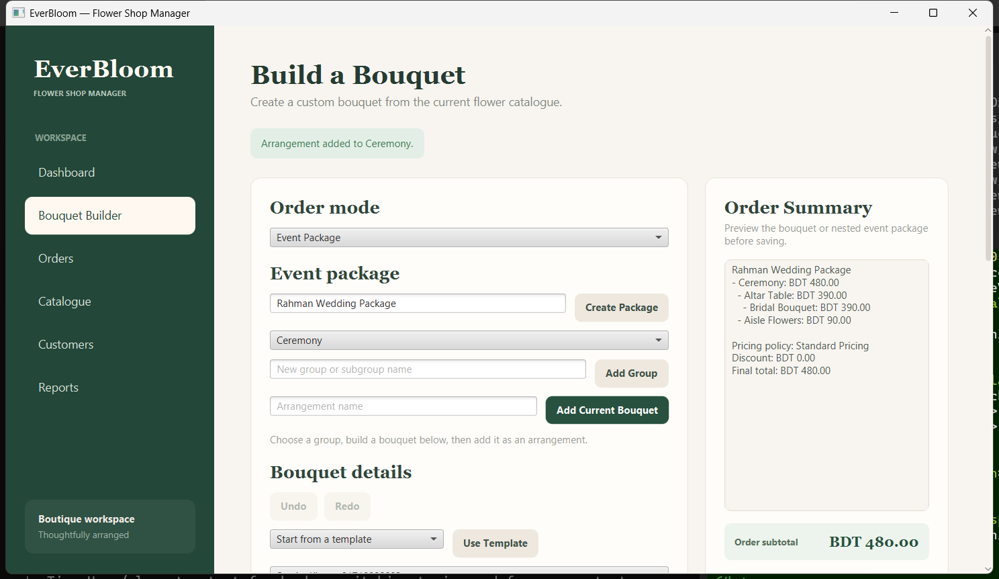

---

## 5. Orders — State and Observer

The selected order has been advanced twice and is now `ARRANGING`. The green
confirmation is written after the new status is persisted, and the same event
refreshes the table.

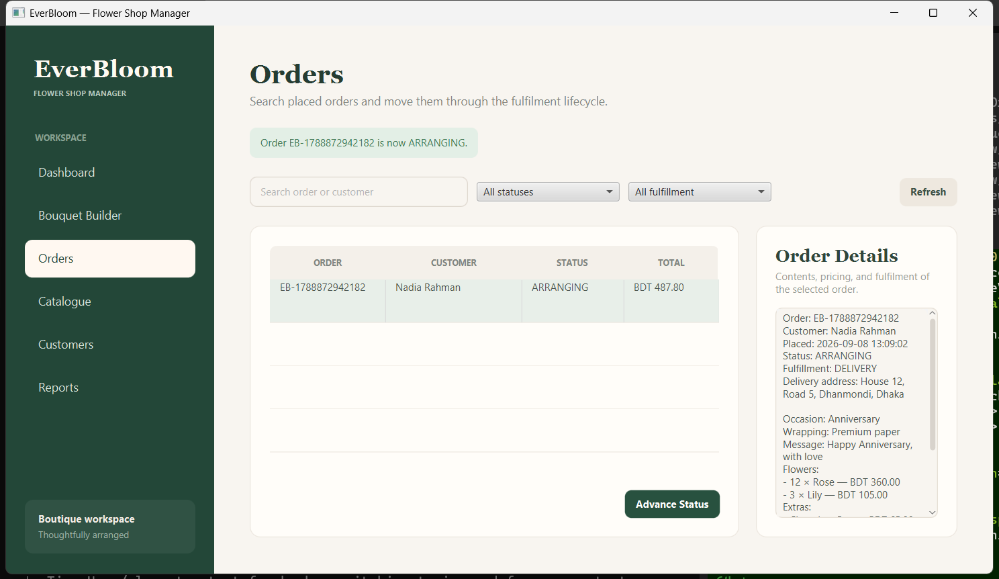

---

## 6. Event order reloaded from SQLite

The saved event package is read back from `arrangements` through
`parent_arrangement_id` and shown as the same tree with the same totals.

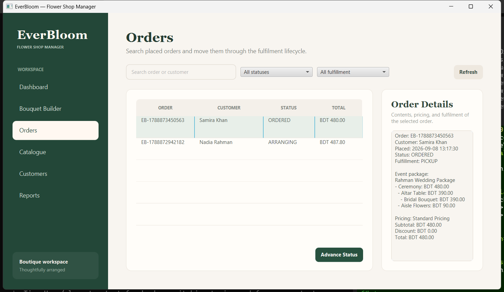

---

## 7. Notifications produced by the Observer

One notification row per successful status change, newest first.

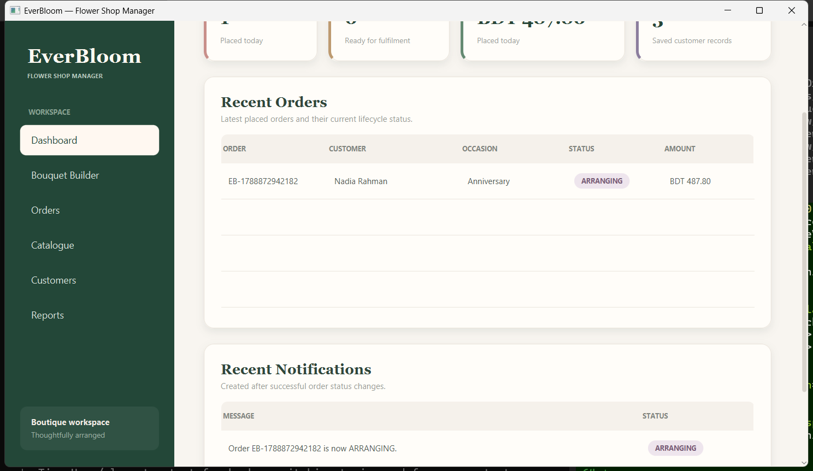

---

## 8. Catalogue

Flowers, extras, and reusable bouquet templates, each with search and full CRUD.

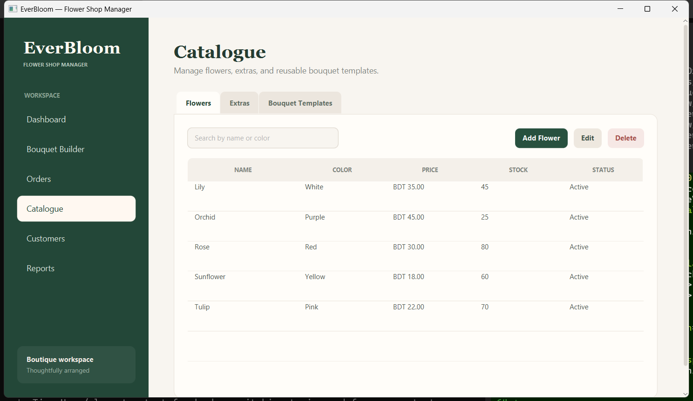

---

## 9. Customers

Customer records with search, add/edit/delete, and the details panel.

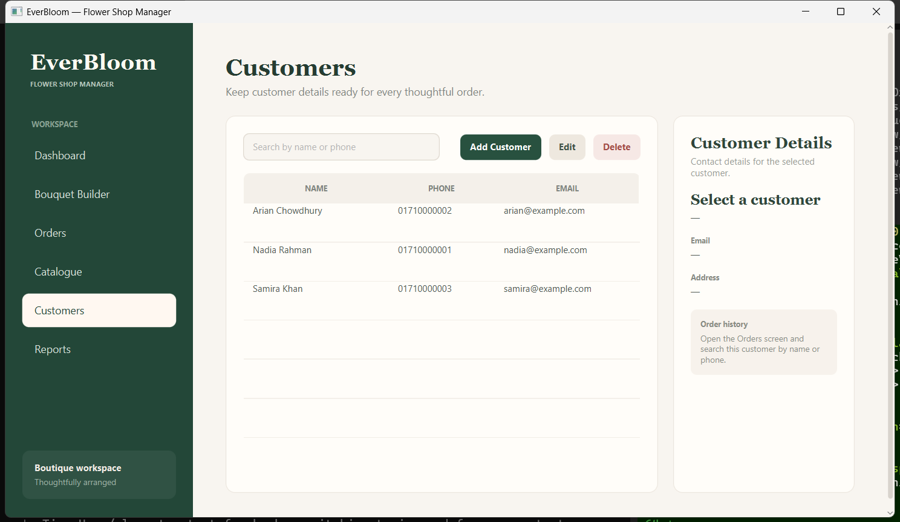

---

## 10. Reports — sales by date

Order count and revenue grouped by day over the selected range.

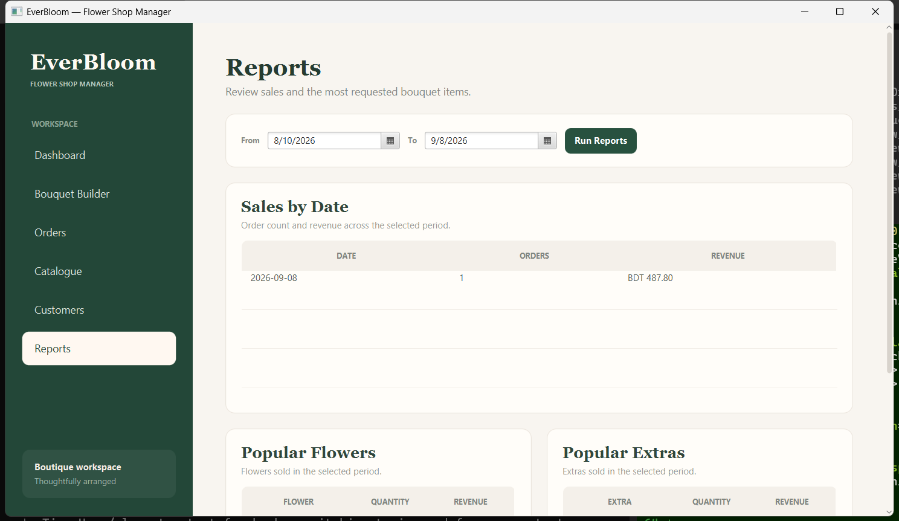

---

## 11. Reports — popular flowers and extras

Both reports are computed from the historical `_snapshot` columns, so they stay
correct after catalogue prices change.

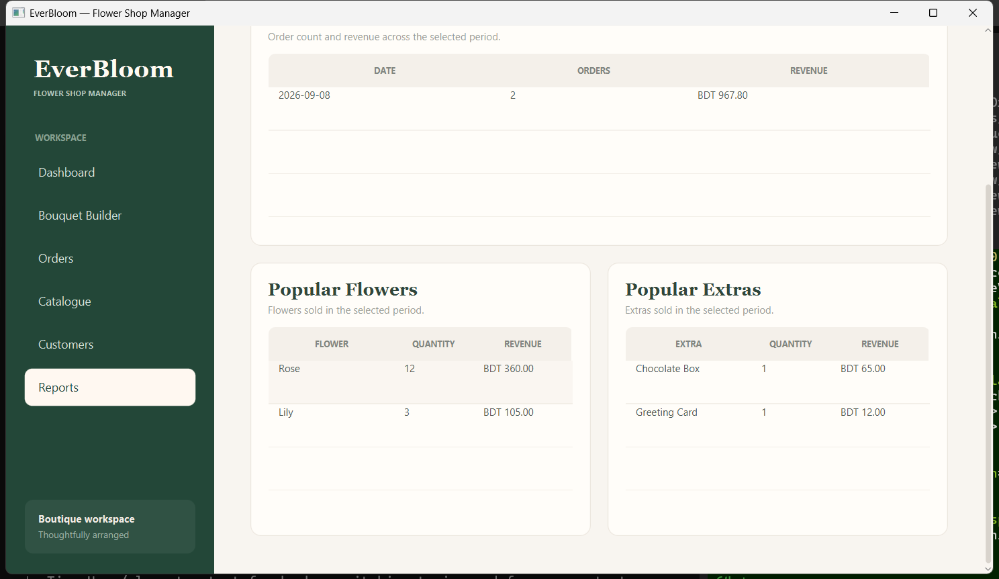
